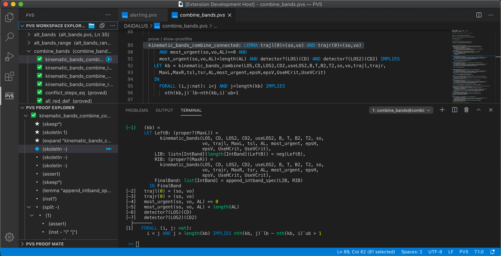

# VSCode-PVS: An Integrated Development Environment for the Prototype Verification System
VSCode-PVS is a new integrated development environment for creating, evaluating and verifying PVS specifications.
The environment redefines the way developers interact with PVS, and better aligns the PVS front-end to the functionalities provided by development environments used by software developers.

## Functionalities
The main functionalities provided by the environment are as follows:
- **Syntax highlighting**: PVS keywords and library functions are automatically highlighted.
- **Autocompletion and code snippets**: Tooltips suggesting function names and language keywords are automatically presented to the user when the user is typing a symbol name in the editor. Code snippets are provided for frequent modeling blocks, e.g., if-then-else. 
- **Hover information for symbol definitions**: Hover boxes providing information about identifiers are automatically displayed when the developer places the cursor over an identifier.
- **Jump-to declaration**: Navigation of symbol declarations can be performed with simple point-and-click actions: the user places the cursor over the name of an identifier, and a click on the name of the identifier while holding the Ctrl key down allow to jump to the location where the identifier is declared.
- **Live diagnostics**: Parsing is automatically performed in the background, and errors are reported in-line in the editor. Problematic expressions are underlined with red wavy lines. Tooltips presenting the error details are shown when the user places the cursor over the wavy lines.
- **In-line actionable commands**: Actionable commands are available for PVS theorems. They are rendered in-line in the editor, above the name of the theorem, and can be used to start a new prover session for the theorem with a simple click action.
- **Overview of PVS theories**: The overall structure of a set of PVS theories is rendered using an interactive tree-based view. It shows the set of PVS theories in the active workspace, as well as the name and status (proved, unfinished, etc.) of the theorems defined in each theory. Point-and-click actions can be used to jump to theory definitions and type-check the theories.
- **Interactive proof tree visualizer and editor**: An interactive tree-based view shows the proof associated with a theorem. Point-and-click actions are provided for step-by-step execution of proof commands. Functionalites for editing the proof are currently under development.
- **Integrated PVS and PVSio Command Line Interfaces**: Integrated command line interfaces allow interaction with the theorem prover and the PVSio evaluator. Auto-completion is provided for prover commands, as well as access to the commands history.

## Installation instructions
- Download the latest release of VSCode-PVS from the [github repository](releases)
- Download NodeJS from https://nodejs.org/en/download
- Download PVS from http://pvs.csl.sri.com
- Download Visual Studio Code from https://code.visualstudio.com
- Install vscode-pvs in VSCode: Extensions tab -> "..." menu -> "Install from VSIX”, and select the downloaded .vsix file
- Set the path to the PVS executable from the Settings menu: Files -> Preferences -> Settings -> Extensions -> PVS -> path
- Have fun using the extension!

## Contacts
* Paolo Masci (NIA) (paolo.masci@nianet.org)
* Cesar Munoz (cesar.a.munoz@nasa.gov)
